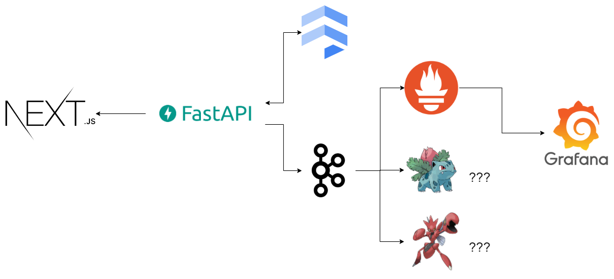

# [MPA](https://mpa.pyoh.dev/)
MPA, as in Melo's Pokémon Adventure, is a proof of concept stack that combines
Kafka messages and Prometheus metrics to monitor the usage and the performance
of a RESTful API.

The API developed for this project allows the user to register and return
information about Pokémon trainers and the Pokémon caught by them.
The API comes coupled with a front end to display the records available in
the API in a more friendly manner.

After each request made to the API, it will send a message to a Kafka broker,
cointaing info about the request and its execution. This info is then made
available to any amount of listeners interested in said data.

Currently, the only listener of this data is a Python server that converts
the Kafka messages into Prometheus metrics, which are then consumed by
a Grafana dashboard. The current stack of this project is as follows.

- [Next.js](https://nextjs.org/)
- [FastAPI](https://fastapi.tiangolo.com/)
- [Cloud Firestore](https://cloud.google.com/firestore)
- [Apache Kafka](https://kafka.apache.org/)
- [Prometheus](https://prometheus.io/)
- [Grafana](https://grafana.com/)

## Getting Started

The easiest way to get started with the stack of the repository is to simply
run the `start.sh` script. This requires that Docker and docker-compose to be
already installed. This script will start docker containers to run every
component of this stack, except for the front end, which must be initialized
separetely. This script will also create the Kafka topics for each endpoint
of the backend API to send messages to.

The following ports will be used by the containers:

| Service                   | Port                                       |
|---------------------------|--------------------------------------------|
| API                       | 8080                                       |
| Kafka                     | 9092 (used inside of the docker network)   |
| Kafka                     | 19092 (used outside of the docker network) |
| Prometheus metrics server | 8000                                       |
| Prometheus                | 9090                                       |
| Grafana                   | 3000                                       |
